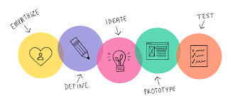

# Contributing to Product Research

### Things you need to know?

What is CodeUino?

What are features of CodeUnio projects?

What is our working flow?

### Things you need to follow

As a community, we follow some research principles to improve the projects and introduce new features which are most demanding. Before getting started, we need you to know the process which we believe and you should follow that while contributing. 

### 1. What is Product Research? Why is it important?

Product research helps to understand the users in a better way. Research can provide more information on the specifications and requirements which are raised by the users. If there is any solution which exists, then the research will help us to understand that and we can get to know whether the current solutions meet the proper requirements or not. This way we can learn what we can provide differently which is in favour of users.

### 2. What are the expectations?

You should be able to study the current similar products available in the market and find out what new features are they providing. If you find any features which are provided in other products but they are not as per requirements of the user, then you should be able to validate that by doing a survey that what point is lacking. In the end you should submit the report which includes your studied product details, how many users you have reached for validations and what new can we implement. 

## **Get Started**

### 1. What should be your approach and process of work

Whenever you start your work, keep the user in mind. User is going to use the product. Steps you need to follow : 

* Find the similar product which are available in the market. Do some study of features provided by that product.
* Find out what new implementations or integrations does that product have and what values does that feature provide to the user.
  * You can do this by performing a survey and asking questions to the users.

And after that you should be able to justify whether that features are useful for users. Along with this, you need to find some ideas which are the most trending or required features for the users.

### 2. Idea Validation

You should follow the process of Design Thinking.  

* It is fine if you skip the empathize step. But we highly recommend to follow this step. If possible you can run the project on your machine locally and try to think of ideas.
* Define the ideas which you find useful to the users when implemented in Codeuino projects
* Contact any of the project members and discuss the idea's feasibility and importance.
* Finalize the idea and if possible think of some visuals 
* Document each and everything and submit to us after ideation stage
* Get involved in the process of finalizing the new feature and prototype stage
* Get the prototypes and test that with some users and get the feedback.

### 3. Submit your analysis

You should document your each and every work and submit it to us in a pdf format along with the statistics of surveys you have performed.

