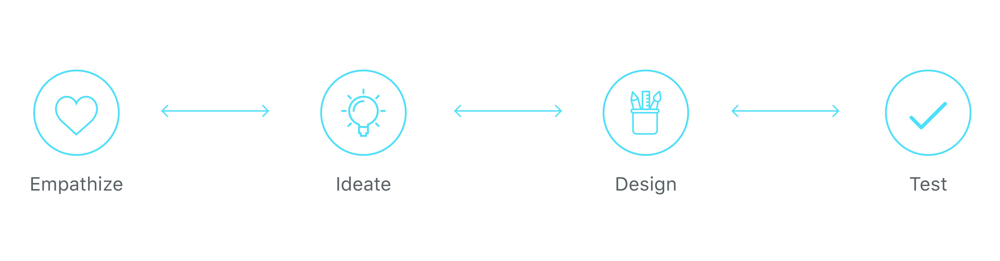

# Design Workflow

## Our Process

We follow a 4-query procedure to solve the design issues. Each question is a step toward the completion of the product.

* **What do we want?** What do we want to achieve for a platform and also as a community? 
* **What do we have?** What information do we have for any new product? Do we have designs or guidelines for improving the design of an existing platform? 
* **How do we get what we want?** How we move forward to solve the design issues? What process do we follow for both new and existing products? ****
* **What will happen when we do?** Are the solutions right? Is the problem solved? Is the new product reaching out and connecting to people?

### Sprints

To increase productivity, we follow sprint cycles which roughly are for 10-15 days. Everything from Ideating, designing, prototyping and re-iterating come under each sprint.

### Why Sprints?

There are several reasons why we have implemented sprints in our design system.

* Time constraint boosts creativity and forces you to make product decisions quickly, thereby increasing our productivity. 
* Team alignment. Having the whole team work closely together on the same goal and with the same information is intensely uniting. 
* To get a better idea of the problem and a broader view of the overall product. 
* Prototyping frees you from the traditional time and money constraints of building a product to test it.

